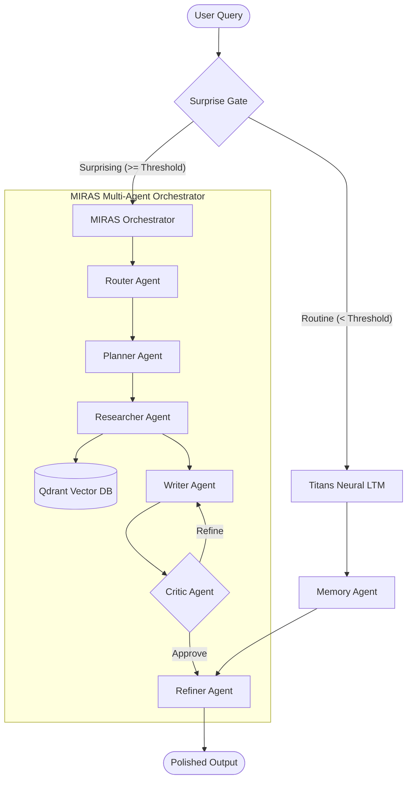

: Enterprise Knowledge Platform with Google Titans Memory

[](https://opensource.org/licenses/MIT)
[](https://www.python.org/downloads/)
[](https://fastapi.tiangolo.com/)
[](https://qdrant.tech/)

> **An enterprise-grade Knowledge Intelligence Assistant built on the Google Titans-inspired Long-Term Memory (LTM) core, hybrid dense-sparse vector search, and the MIRAS multi-agent orchestration framework.**

---

## 🚀 Key Features

*   **Google Titans Memory Core:** A weight-binding neural association matrix that stores and recalls conversational facts and preferences locally.
*   **Adaptive Surprise-Routing:** Dynamically measures the reconstruction loss (surprise) of incoming queries, routing routine queries to local memory weights and reserving heavy vector search for novel facts.
*   **Microservice Multi-Agent Orchestration:** Coordinated pipeline of 7 specialized microservice agents (Router, Planner, Memory, Researcher, Writer, Critic, Refiner).
*   **Critic-Writer Debate Loop:** Iterative audit cycles ensuring all generated answers are factually accurate, citation-backed, and grounded.
*   **Local-Cloud Hybrid Cascading:** Runs locally first using Ollama (`gemma2:2b`, `deepseek-coder`), cascading to cloud failovers (OpenRouter paid key, Groq, Gemini) automatically.

---

## 📐 System Architecture

VYOR-AI splits execution paths based on query novelty to optimize latency, API token consumption, and retrieval quality.



---

## 📊 Empirical Verification Results

VYOR-AI has been rigorously validated across multiple baseline tests:

### 1. Baselines & Latency Comparison
The system achieves a **2.25x speedup in average latency** and a **6.3x tail (p95) speedup** compared to standard agentic RAG searches.

| Configuration | Avg Latency (s) | p95 Latency (s) | Avg Confidence | Avg Citations | Uncertainty Triggers |
| :--- | :--- | :--- | :--- | :--- | :--- |
| **Full VYOR System** | **20.53s** | **37.54s** | 37.50% | 0.3 | 6 |
| **No Memory Baseline** | **46.15s** | **236.73s** | 39.00% | 0.3 | 6 |
| **Vanilla RAG Baseline** | 19.54s | 44.73s | 80.00% | 1.0 | 0 |
| **No Debate Baseline** | 23.25s | 42.38s | 38.20% | 0.3 | 7 |

### 2. Component Ablation Study
Removing critical features reveals their computational utility:
*   **Removing Surprise Gate:** Results in a **73% slowdown** (`14.17s` ➔ `24.60s`).
*   **Removing Titans LTM:** Results in a **101% slowdown** (`14.17s` ➔ `28.57s`).

### 3. LTM Capacity & Forgetting
Using adaptive forgetting weight decay ($\alpha = 0.5$) keeps parameter norms bounded, preventing memory saturation:

| Step | No Decay (Alpha=0.0) Norm | With Decay (Alpha=0.5) Norm | No Decay Loss | With Decay Loss |
| :--- | :--- | :--- | :--- | :--- |
| 1 | 34.5699 | 34.3987 | 0.7344 | 0.6854 |
| 100 | 34.4998 | 20.9018 | 0.6789 | 0.4955 |
| **500** | **34.2116** | **3.0327** | **0.5544** | **0.3904** |

---

## 🛠️ Installation & Setup

### 1. Prerequisites
Ensure you have **Python 3.10+** and **Docker** installed.

### 2. Clone and Setup Environment
```bash
git clone <repository-url>
cd vyor-ai
python -m venv .venv
```
Activate virtual environment:
*   **Windows:** `.\.venv\Scripts\activate`
*   **macOS/Linux:** `source .venv/bin/activate`

Install dependencies:
```bash
pip install -r requirements.txt
```

### 3. Configure Environment Variables
Copy `.env.example` to `.env`:
```bash
cp .env.example .env
```
Ensure your `OPENROUTER_API_KEY`, `GROQ_API_KEY`, or `GEMINI_API_KEY` are configured.

### 4. Start Infrastructure
Launch Qdrant, PostgreSQL, and Redis cache:
```bash
docker-compose up -d
```

---

## 🚀 Running the System

### 1. Start the API Backend Server
Run the FastAPI application locally:
```bash
uvicorn src.api.app:app --reload --port 8000
```
*   **OpenAPI Documentation:** `http://localhost:8000/docs`
*   **Swagger Playground:** Explore endpoints like `/query` and `/upload` interactively.

### 2. Launch the Streamlit Dashboard
Run the visual administrative dashboard:
```bash
streamlit run dashboard.py --server.port 8501
```
*   **Local Webpage URL:** `http://localhost:8501`

---

## 🧪 Running the Benchmark Suite

To execute the scientific validation suite and refresh report outputs, run:

```bash
# General RAG baseline comparisons
python benchmarks/expanded_benchmark.py

# Multi-Agent debate reasoning benchmarks
python benchmarks/test_gsm8k.py
python benchmarks/test_mmlu.py

# Ablation study & threshold sweep
python benchmarks/full_ablation.py
python benchmarks/threshold_sweep.py

# Resource profiling & scalability
python benchmarks/memory_capacity.py
python benchmarks/routing_accuracy.py
python benchmarks/scalability_study.py
python benchmarks/cost_analysis.py
python benchmarks/failure_cases.py
```
All outputs are written as JSON arrays and Markdown reports in `benchmarks/results/`.

---

## 📦 Project Structure

```text
vyor-ai/
├── docker-compose.yml     # Infrastructure setup (Qdrant, PG, Redis)
├── Dockerfile             # Containerization instructions
├── requirements.txt       # Core Python packages
├── dashboard.py           # Streamlit dashboard interface
├── surprise_gate.py       # Adaptive surprise gate routing
├── titans_memory.py       # Titans memory brain interface
├── orchestrator.py        # Microservice multi-agent orchestrator
├── src/
│   ├── integration_interface.py  # Application API contracts
│   ├── api/                      # FastAPI endpoint controllers
│   ├── agents/                   # MIRAS microservice agents
│   └── vector_db/                # Qdrant manager
└── benchmarks/            # Complete verification suites
```
